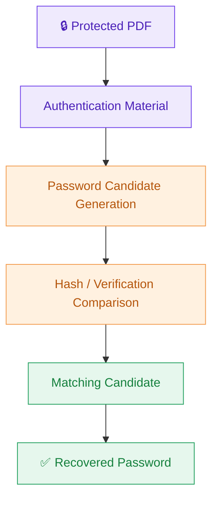
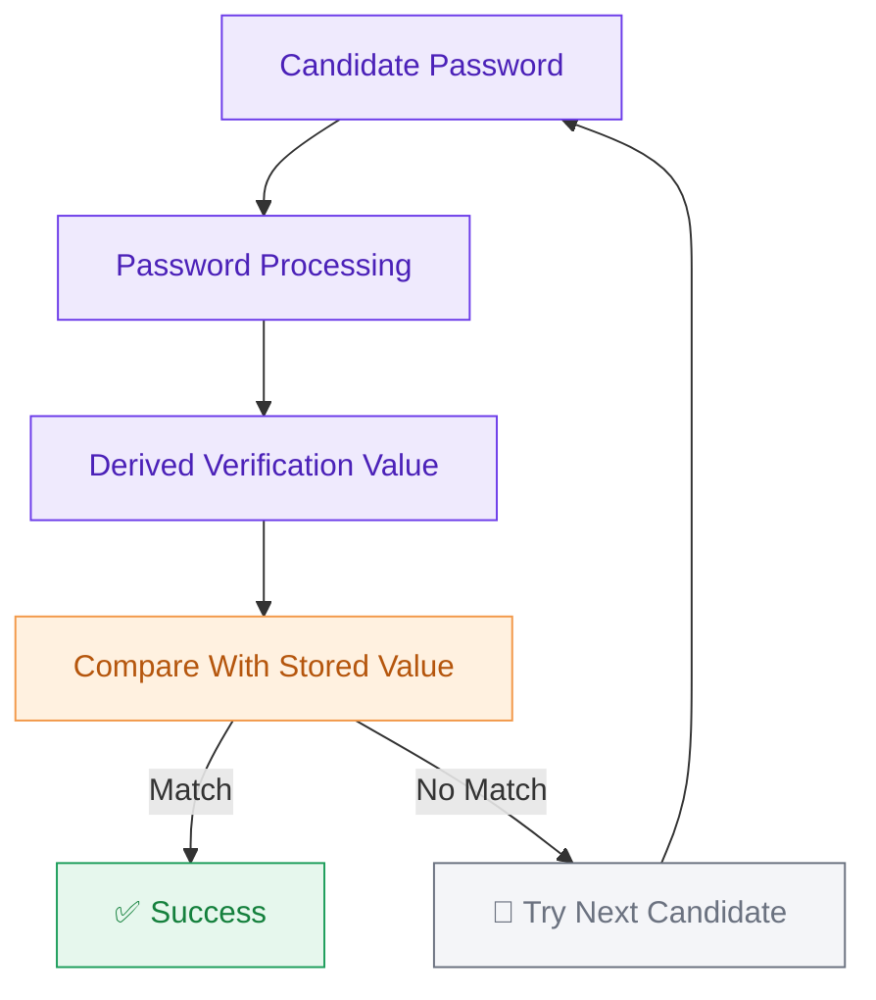

# Methodology

This file explains the methodology used in the project.

## 🔗 Navigation

- [Back to README](README.md)
- [EVIDENCE](lab-Result.md)
- # 📘 Methodology

### Password Security Assessment — Authorized Laboratory Environment

---

## 📑 Table of Contents

1. [🧭 Methodology Overview](#1--methodology-overview)
2. [🗂️ Assessment Approach](#2-️-assessment-approach)
3. [🧪 Laboratory Preparation](#3--laboratory-preparation)
4. [🔍 Protected File Analysis](#4--protected-file-analysis)
5. [🔑 Authentication Material Acquisition](#5--authentication-material-acquisition)
6. [⚙️ Offline Password Analysis](#6-️-offline-password-analysis)
7. [🧮 Candidate Evaluation](#7--candidate-evaluation)
8. [✅ Result Validation](#8--result-validation)
9. [🛡️ Security Analysis](#9-️-security-analysis)
10. [🗃️ Evidence Handling](#10-️-evidence-handling)
11. [🧾 Methodology Validation](#11--methodology-validation)
12. [⚠️ Risk Interpretation](#12-️-risk-interpretation)
13. [⚖️ Ethical Boundaries](#13-️-ethical-boundaries)
14. [🏁 Methodology Outcome](#14--methodology-outcome)
15. [🔁 Reproducibility Statement](#15--reproducibility-statement)
16. [🚫 Disclaimer](#-disclaimer)

---

## 1. 🧭 Methodology Overview

This project follows a **controlled and repeatable methodology** for evaluating password security against a password-protected PDF file in an authorized laboratory environment.

The methodology focuses on the **security lifecycle** behind password recovery rather than simply documenting individual tool operations. It explains how the protected file was assessed, how the authentication material was handled, how the recovered result was validated, and how the security implications were evaluated.

> 💡 The complete assessment was performed only against a deliberately selected laboratory file for educational and ethical hacking purposes.

---

## 2. 🗂️ Assessment Approach

The assessment was organized into the following phases:

| Phase | Focus | Expected Outcome |
|:---:|:---|:---|
| 🟣 **Phase 1** | Environment Preparation | Confirm that the required lab resources are available |
| 🟣 **Phase 2** | Protected File Assessment | Establish that the PDF requires authentication |
| 🟠 **Phase 3** | Hash Acquisition | Obtain the password-verification representation from the authorized file |
| 🟠 **Phase 4** | Offline Analysis | Submit the extracted representation to the password-analysis tool |
| 🟢 **Phase 5** | Result Verification | Validate the recovered credential against the original file |
| 🟢 **Phase 6** | Security Evaluation | Interpret the result from a defensive security perspective |
| 🔵 **Phase 7** | Documentation | Preserve observations and lessons learned |

> 💡 This phased structure helps separate **data acquisition, password analysis, verification, and security interpretation**.

---

## 3. 🧪 Laboratory Preparation

Before beginning the assessment, the laboratory environment was prepared to ensure that the test remained isolated from unauthorized systems or information.

**The following conditions were considered:**

- ✔️ A password-protected PDF was used as the test artifact.
- ✔️ The file was intentionally selected for the authorized training exercise.
- ✔️ The required Networkwalks web-based utilities were accessible.
- ✔️ The assessment was performed from an approved laboratory environment.
- ✔️ No third-party account credentials or unrelated files were targeted.
- ✔️ Results were recorded only for documentation and learning purposes.

> 💡 The purpose of this preparation stage was to establish a controlled baseline before performing any password-security testing.

---

## 4. 🔍 Protected File Analysis

The first analytical stage was to examine the behavior of the protected document.

**The assessment confirmed that:**

1. The PDF could be accessed as a file but its protected contents required a password.
2. Direct access without the correct password was unsuccessful.
3. The document therefore provided a suitable artifact for password-security testing.
4. The original file was retained unchanged throughout the assessment.

> 💡 This stage established the initial condition against which the final verification could be compared.

---

## 5. 🔑 Authentication Material Acquisition

Instead of attempting to modify or damage the protected document, the assessment used the authorized hash-calculation functionality to obtain the password-verification data associated with the PDF.

The extracted value was treated as **authentication material**, not as the original password.

This distinction is important because password-protection mechanisms generally do not require the original plaintext password to be stored directly. A derived representation can instead be used during password verification.

> 💡 The extracted value was therefore transferred to the password-analysis stage without modifying the source PDF.

---

## 6. ⚙️ Offline Password Analysis

The extracted authentication material was then supplied to the authorized password-analysis environment.

The analysis conceptually follows this process:

The analysis attempts candidate passwords and determines whether a candidate produces the required verification result.

This demonstrates an important security principle:

> ⚡ **The effectiveness of password protection depends heavily on the strength and unpredictability of the password selected by the user.**

---

## 7. 🧮 Candidate Evaluation

During password analysis, candidate values are evaluated against the extracted verification data.

A simplified conceptual model is:

A successful match indicates that the candidate corresponds to the password protecting the authorized document.

> 💡 No attempt was made to bypass authentication through unauthorized access to external systems.

---

## 8. ✅ Result Validation

Finding a candidate password was not treated as the final proof.

The recovered value was independently validated by attempting to open the original protected PDF.

**Validation consisted of confirming that:**

- ✅ The original file remained intact.
- ✅ The recovered value was accepted by the document.
- ✅ The protected content became accessible.
- ✅ The observed result was consistent with the password-analysis result.

> 💡 This additional validation step reduces the possibility of treating an incorrect or incomplete analysis result as a successful recovery.

---

## 9. 🛡️ Security Analysis

The result was interpreted from a **defensive cybersecurity perspective** rather than simply considering whether the password was recovered.

**The following factors were considered:**

| Factor | Explanation |
|:---|:---|
| 🔐 **Password Complexity** | Passwords with predictable patterns, common words, or limited character diversity generally provide less resistance to automated guessing. |
| 📏 **Password Length** | Longer passwords typically provide a significantly larger candidate space, making exhaustive guessing more difficult. |
| 🎯 **Predictability** | Human-generated passwords may contain patterns that reduce the effective search space. |
| 💰 **Attack Cost** | Practical resistance depends on candidate-space size, password structure, verification speed, available computing resources, and attack strategy. |

> 🚨 A password that can be recovered quickly in a controlled laboratory environment should be considered insufficient for protecting sensitive information.

---

## 10. 🗃️ Evidence Handling

Evidence was maintained throughout the assessment to make the methodology reproducible.

**Relevant evidence included:**

- 📄 Initial protected-file state
- 🔑 Authentication-material extraction result
- ⚙️ Password-analysis status
- ✅ Successful validation result
- 📝 Final observations

> 💡 The original protected document was not intentionally altered during testing.

> ⚠️ Sensitive values should not be unnecessarily published in public repositories. Where appropriate, screenshots or extracted values should be redacted before publication.

---

## 11. 🧾 Methodology Validation

The methodology was considered **successful** when all of the following conditions were satisfied:

- [x] The protected document remained unchanged.
- [x] Authentication material was successfully obtained from the authorized artifact.
- [x] The password-analysis process produced a candidate result.
- [x] The candidate was tested against the original document.
- [x] The document accepted the recovered credential.
- [x] The result could be explained from a password-security perspective.

> 💡 This provides a clear distinction between **attempted recovery** and **verified recovery**.

---

## 12. ⚠️ Risk Interpretation

The exercise demonstrates that **password protection alone does not guarantee strong security**.

If a password can be recovered using an automated analysis process, the underlying issue may be the weakness or predictability of the password rather than a failure of the document format itself.

**From a defensive perspective, organizations should therefore consider:**

- 🔒 Using sufficiently long passwords.
- 🚫 Avoiding commonly used words and predictable patterns.
- 🔁 Using unique passwords for sensitive documents.
- 🗝️ Protecting passwords through appropriate credential-management practices.
- 👁️ Avoiding unnecessary exposure of password-protected files.
- 🛡️ Applying additional encryption or access-control mechanisms where appropriate.

---

## 13. ⚖️ Ethical Boundaries

This methodology is intended **strictly** for:

- 🎓 Authorized cybersecurity laboratories
- 📚 Academic research
- 🕵️ Ethical hacking training
- 📢 Security-awareness demonstrations
- 📁 Files owned by or explicitly provided for testing

> 🚫 **The methodology must not be applied to documents, accounts, systems, or data without explicit authorization.**

> ⚠️ Password-recovery techniques can expose sensitive information when misused. Therefore, authorization, scope, and responsible handling of recovered information are essential parts of the methodology.

---

## 14. 🏁 Methodology Outcome

The assessment provided practical experience in understanding the relationship between:

**Document Protection → Authentication Data → Password Analysis → Verification → Security Assessment**

Rather than treating password cracking as an isolated technical activity, this methodology demonstrates it as a **controlled security-testing process** involving preparation, acquisition, analysis, validation, evidence handling, and defensive interpretation.

---

## 15. 🔁 Reproducibility Statement

The methodology is designed so that the same assessment structure can be reproduced in an authorized laboratory environment using a test document and approved password-analysis tools.

> 💡 Reproduction should always use a deliberately created or explicitly authorized test file and should remain within the defined assessment scope.
> 
## 🔗 Navigation

- [Back to README](README.md)
- [EVIDENCE](lab-Result.md)
---

## 🚫 Disclaimer

> **This methodology is provided exclusively for educational, defensive-security, and authorized penetration-testing purposes.**
>
> **The techniques described must not be used to access or recover passwords from systems or files without explicit permission.**

---

