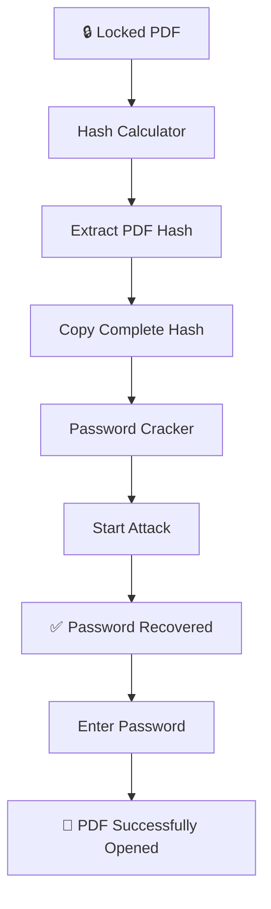

# networkwalks-B082-Week3-Password-Cracking-with-Nw-Tools
# 🔐 Password Cracking with Networkwalks Tools

### Cybersecurity & Ethical Hacking — Project Module 2 · Week 3

**Educational cybersecurity lab demonstrating password-hash extraction and password recovery from an authorized, password-protected PDF file using Networkwalks browser-based tools.**


---

## 📌 Project Overview

Password cracking is the process of recovering a password from stored data or a protected file. Security professionals use password-cracking techniques to evaluate password strength and demonstrate the risks associated with weak passwords.

This project uses a password-protected PDF file to walk through the complete password-cracking workflow:

1. Extract the password hash from the locked PDF.
2. Copy the complete hash value.
3. Submit the hash to a password-cracking tool.
4. Recover the password.
5. Use the recovered password to open the protected PDF.

The lab relies on two free, browser-based tools provided by **Networkwalks**:

| Tool | Function |
|---|---|
| 🧮 **Networkwalks Hash Calculator** | Extracts the hash from the locked PDF |
| 🔓 **Networkwalks Password Cracker** | Attempts to recover the original password from the extracted hash |

Both tools operate entirely through a web browser, so no additional software installation is required.

---

## 🎯 Objectives

- Understand how password-protected files store password-related information
- Learn how a password hash can be extracted from a protected PDF
- Understand the basic workflow of password cracking
- Use the Networkwalks Hash Calculator
- Use the Networkwalks Password Cracker
- Demonstrate the security risks associated with weak passwords
- Understand why strong, complex passwords matter

---

## 🧰 Tools & Technologies

| Tool / Technology | Purpose |
|---|---|
| **Networkwalks Hash Calculator** | Extract the password hash from the locked PDF |
| **Networkwalks Password Cracker** | Attempt to recover the password from the extracted hash |
| **Web Browser** | Access and operate both Networkwalks tools |
| **Windows / Kali Linux** | Lab environment |
| **Password-Protected PDF** | Authorized lab target |

> The lab can be performed on either Windows or Kali Linux, since both tools run entirely in the browser.

---

## 🧪 Lab Target

**Target File:**
```text
My Locked PDF4.pdf
```

The target is a password-protected PDF supplied specifically for this lab exercise.

> ⚠️ **Important:** Password-cracking techniques should only be used against files, systems, or data that you own or have explicit authorization to test.

---

## 🔄 Lab Workflow



---

## 🚀 Step-by-Step Procedure

### Step 1 — Download the Encrypted PDF

Download the authorized lab file:
```text
My Locked PDF4.pdf
```
The original lab provides this file through the Networkwalks project-task page.

### Step 2 — Open Hash Calculator

Open the Networkwalks Hash Calculator in a web browser:

🔗 **Hash Calculator:** https://networkwalks.com/hash-calculator/

This tool is used to extract the password hash from the protected PDF.

### Step 3 — Upload the Locked PDF

Upload:
```text
My Locked PDF4.pdf
```
The tool processes the protected PDF and generates a hash value beginning with:
```text
$pdf$
```
According to the lab instructions, this is the PDF password hash used in the next stage.

### Step 4 — Copy the Complete Hash

Copy the **entire hash value**. Make sure the copied hash:

- ✅ Starts with `$pdf$`
- ✅ Contains the complete value
- ✅ Has no missing characters
- ✅ Contains no additional spaces

Example format:
```text
$pdf$....................
```

> ⚠️ Do not use an incomplete hash — the password-cracking stage requires the full value.

### Step 5 — Open Password Cracker

Open the Networkwalks Password Cracker:

🔗 **Password Cracker:** https://networkwalks.com/password-cracker/

The extracted PDF hash is supplied to this tool for password recovery.

### Step 6 — Start the Password-Cracking Process

Paste the complete PDF hash into the Password Cracker, then start the attack.

```text
PDF Hash → Password Cracker → Password Attempts → Matching Password
```

The tool attempts different passwords until it finds a match for the supplied hash.

### Step 7 — Wait for the Result

Allow the tool to complete its process. The time required depends on password complexity — simpler passwords are generally recovered faster than complex ones.

**Lab Result:**
```text
1qaz2wsx
```

### Step 8 — Open the Protected PDF

Open:
```text
My Locked PDF4.pdf
```
When prompted, enter the recovered password:
```text
1qaz2wsx
```

### Step 9 — Verify the Result

```text
PDF → Successfully Opened ✅
```
At this point, the password-cracking lab is complete.

---

## 📊 Results Summary

| Stage | Result |
|---|---|
| Target | Password-protected PDF |
| Hash Extraction | ✅ Completed |
| Hash Format | `$pdf$...` |
| Hash Copy | ✅ Completed |
| Password Cracking | ✅ Completed |
| Password Recovered | `1qaz2wsx` |
| PDF Unlocking | ✅ Successful |
| **Lab Status** | **✅ Completed** |

---

## 🧠 Key Concepts Learned

### 1. Password Hash
A hash is a scrambled representation of information. In this lab, password-related data from the protected PDF is extracted into a hash beginning with `$pdf$`, which is then supplied to the password-cracking tool.

### 2. Password Cracking
Password cracking attempts to recover the original password by trying possible values against the available hash — demonstrated here using the Networkwalks Password Cracker.

### 3. Encryption vs. Hashing

| Encryption (Two-Way) | Hashing (One-Way) |
|---|---|
| Plaintext → Encryption + Key → Ciphertext → Decryption + Key → Plaintext | Plaintext → Hash Function → Hash / Message Digest |
| Reversible with the correct key | Cannot be reversed back to plaintext |

---

## 🔎 Security Lessons

- Simple passwords can potentially be cracked much faster
- Stronger, more complex passwords significantly increase resistance to cracking attempts
- Common passwords such as `123456` and `password` remain widely used
- Previously leaked credentials can continue circulating for years

### ✅ Recommended Password Practices
Use passwords that are:
- Long
- Complex
- Unique
- Difficult to guess
- Not based on common words or predictable patterns

---

## 🛡️ Ethical & Responsible Use

This project is intended strictly for:
- Cybersecurity education
- Ethical hacking training
- Authorized security testing
- Password-security awareness
- Laboratory experimentation

### ⚠️ Do Not Use These Techniques Without Authorization
Do not attempt to crack passwords belonging to:
- Other individuals
- Organizations
- Websites
- Online accounts
- Devices
- Files
- Systems

...unless you have explicit permission to perform the security assessment.

> **Always perform cybersecurity testing legally and within the defined scope of authorization.**

---

## 📁 Repository Structure

```text
password-cracking-with-networkwalks-tools/
│
├── README.md
│
├── screenshots/
│   ├── 01-lab-page.png
│   ├── 02-hash-calculator.png
│   ├── 03-hash-extracted.png
│   ├── 04-hash-copied.png
│   ├── 05-password-cracker.png
│   ├── 06-attack-started.png
│   ├── 07-password-recovered.png
│   ├── 08-pdf-password-prompt.png
│   └── 09-pdf-opened.png
│
├── evidence/
│   └── lab-results.md
│
└── docs/
    └── methodology.md
```

> Keep sensitive information, real credentials, unauthorized hashes, and private files out of a public repository.

---

## 📸 Evidence & Screenshots

```markdown
## Hash Extraction
![Hash Calculator]


## Password Recovered
![Password Cracker]


## PDF Successfully Opened
![Unlocked PDF]


```

---

## 📚 Learning Outcomes

- Password-protected PDF analysis
- PDF hash extraction
- Hash identification
- Password-cracking workflow
- Browser-based cybersecurity tools
- Password-strength awareness
- Ethical hacking methodology
- Security testing within an authorized environment

---

## 💡 Key Takeaways

> 🔐 **Weak passwords can create significant security risks.**
>
> 🧩 **Password hashes can be analyzed with specialized security tools.**
>
> 🛡️ **Strong and unique passwords provide better protection.**
>
> ⚖️ **Password-cracking techniques must only be used in authorized environments.**
>
> 🎓 **Hands-on labs help cybersecurity professionals understand real-world security concepts.**

---

## 🔗 References

- **Project Task Lab:** https://networkwalks.com/project-task-lab-password-cracking-with-networkwalks-tools/
- **Hash Calculator:** https://networkwalks.com/hash-calculator/
- **Password Cracker:** https://networkwalks.com/password-cracker/

---

## 📖 Source Material

This documentation is based on:

**Password Cracking with Networkwalks Tools**
Cybersecurity & Ethical Hacking Project Tasks — Week 3, Project Module 2

The original lab document provides the background, task description, nine-step procedure, and additional password-security references used in this project.

---

## 👨‍💻 Project Information

| Field | Details |
|---|---|
| **Project** | Password Cracking with Networkwalks Tools |
| **Module** | Project Module 2 |
| **Week** | Week 3 |
| **Domain** | Cybersecurity & Ethical Hacking |
| **Primary Target** | Authorized Password-Protected PDF |
| **Hash Tool** | Networkwalks Hash Calculator |
| **Cracking Tool** | Networkwalks Password Cracker |
| **Platform** | Windows / Kali Linux |
| **Status** | ✅ Completed |

---

## ⭐ Conclusion

This project provided a practical introduction to the password-cracking workflow by extracting a PDF password hash and using a password-cracking tool to recover the password.

The exercise demonstrates an important cybersecurity principle:

> **Security is not only about protecting systems — it is also about understanding how attackers may attempt to compromise weak security controls.**

Understanding password-cracking techniques allows cybersecurity professionals to better evaluate password strength, identify weaknesses, and recommend stronger security practices.

## 📚 Documentation

- [Methodology](Methodology.md)
- [Lab Results](lab-Result.md)
---

### ⚠️ Disclaimer

This repository is created for **educational and authorized cybersecurity testing purposes only**.
The techniques demonstrated here should only be performed on systems, files, and environments where explicit authorization has been provided.

**Use responsibly. Stay ethical. Hack legally. 🔐**

## 👤 Author

Rabi Chaudhary

Cybersecurity Professional B082

LinkedIn:

## 📌 Project Information

Program Name: Cybersecurity program at Networkwalks | Week: 03 | Repository: GitHub

